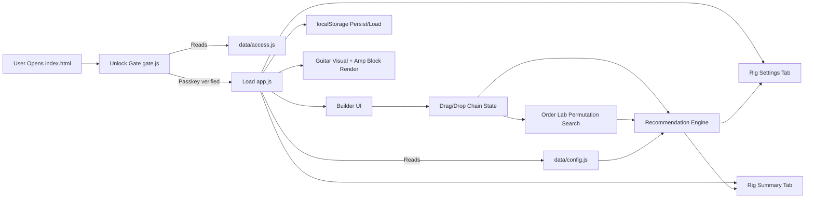

# Functional Diagram

```mermaid
flowchart LR
    U[User Opens index.html] --> G[Unlock Gate gate.js]
    G -->|Reads| A[data/access.js]
    G -->|Passkey verified| APP[Load app.js]
    APP -->|Reads| C[data/config.js]

    APP --> B[Builder UI]
    APP --> S[Rig Settings Tab]
    APP --> R[Rig Summary Tab]

    B --> D[Drag/Drop Chain State]
    D --> O[Order Lab Permutation Search]
    D --> E[Recommendation Engine]
    O --> E
    C --> E
    E --> S
    E --> R

    APP --> L[localStorage Persist/Load]
    APP --> GV[Guitar Visual + Amp Block Render]
```
