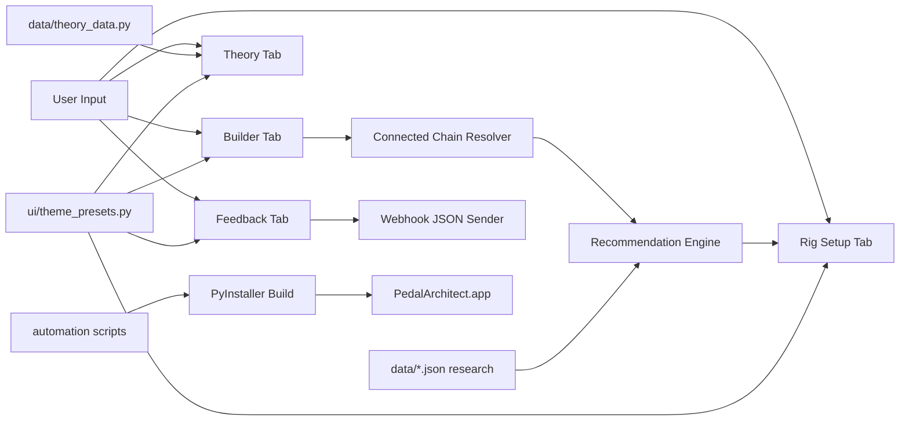

# Functional Diagram

```mermaid
flowchart LR
    U[User Input] --> B[Builder Tab]
    U --> R[Rig Setup Tab]
    U --> T[Theory Tab]
    U --> F[Feedback Tab]

    B --> C[Connected Chain Resolver]
    C --> E[Recommendation Engine]
    E --> R

    D1[data/theory_data.py] --> T
    D2[data/*.json research] --> E
    U1[ui/theme_presets.py] --> B
    U1 --> R
    U1 --> T
    U1 --> F
    F --> W[Webhook JSON Sender]

    A[automation scripts] --> P[PyInstaller Build]
    P --> APP[PedalArchitect.app]
```
